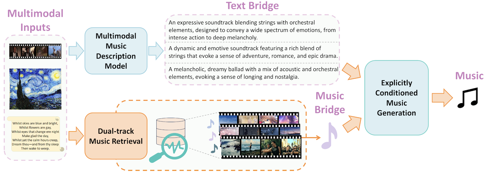
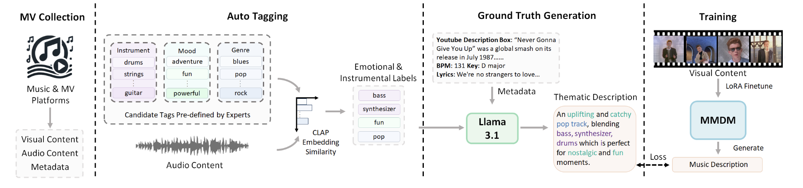
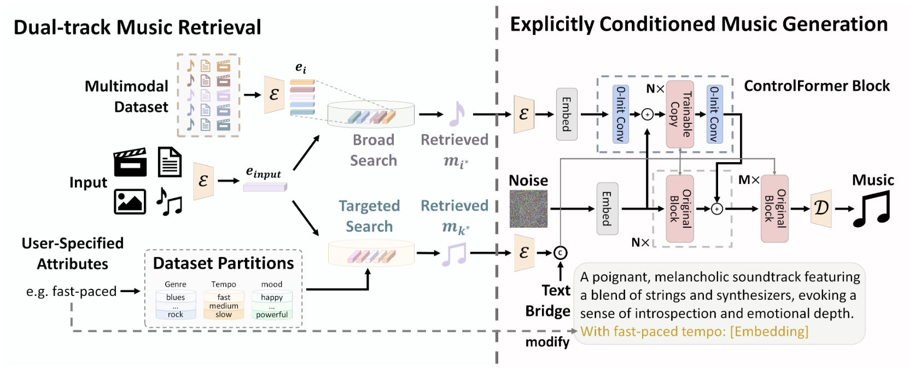

# 🎬🎵 VMB

[[Paper]](https://arxiv.org/abs/2412.09428) [[Demos]](https://wzk1015.github.io/vmb/)


Code for our paper ["Multimodal Music Generation with Explicit Bridges and Retrieval Augmentation"]((https://arxiv.org/abs/2412.09428))


We will release our code soon.


## 🎵 Demos

Video-to-music demos are available on the [project page](https://wzk1015.github.io/vmb/).


## 📅 Schedule

* [x] Video-to-music demos
* [ ] Text-to-music and image-to-music demos
* [ ] Video-music dataset
* [ ] Pretrained model weights
* [ ] Inference code
* [ ] Evaluation code
* [ ] Training code


## ⭐️ Highlights

**TL;DR:** We present Visuals Music Bridge (VMB), a novel framework for **multimodal music generation** by using text and music as explicit bridges to address challenges in data scarcity, cross-modal alignment, and controllability. VMB significantly improves music quality, modality alignment, and customization across tasks like video-to-music, image-to-music and text-to-music generation and controllable music generation.

* Proposes **explicit text and music bridges** for better multimodal alignment, leveraging detailed textual descriptions and retrieval-augmented generation.

* Introduces a Multimodal Music Description Model, Dual-track Music Retrieval, and Explicitly Conditioned Music Generation for enhanced quality and control.

* Demonstrates state-of-the-art performance in **video-to-music**, **image-to-music**, **text-to-music**, and **controllable music generation** tasks.

<p align="center">
 
</p>


## 📌 Abstract

Multimodal music generation aims to produce music from diverse input modalities, including text, videos, and images. Existing methods use a common embedding space for multimodal fusion. Despite their effectiveness in other modalities, their application in multimodal music generation faces challenges of data scarcity, weak cross-modal alignment, and limited controllability. This paper addresses these issues by using explicit bridges of text and music for multimodal alignment.
We introduce a novel method named Visuals Music Bridge (VMB). Specifically, a Multimodal Music Description Model converts visual inputs into detailed textual descriptions to provide the text bridge; a Dual-track Music Retrieval module that combines broad and targeted retrieval strategies to provide the music bridge and enable user control. Finally, we design an Explicitly Conditioned Music Generation framework to generate music based on the two bridges. We conduct experiments on video-to-music, image-to-music, text-to-music, and controllable music generation tasks, along with experiments on controllability. The results demonstrate that VMB significantly enhances music quality, modality, and customization alignment compared to previous methods. VMB sets a new standard for interpretable and expressive multimodal music generation with applications in various multimedia fields.


## 🔍 Method

Multimodal Music Description Model (MMDM)



Dual-track Music Retrieval and Explicitly Conditioned Music Generation




## 📊 Dataset

TODO

## 🛠️ Usage

TODO


## 📃 License

This project is released under the MIT license.


## 🖊️ Citation

If you find this work helpful for your research, please consider giving this repo a star ⭐ and citing our paper:

```bibtex
@article{vmb,
  title={Multimodal Music Generation with Explicit Bridges and Retrieval Augmentation},
  author={Wang, Baisen and Zhuo, Le and Wang, Zhaokai and Bao, Chenxi and Wu, Chengjing and Nie, Xuecheng and Dai, Jiao and Han, Jizhong and Liao, Yue and Liu, Si},
  journal={arXiv preprint arXiv:2412.09428},
  year={2024}
}
```

## 📚 See Also

Our previous papers on video-to-music generation:
 * [MusProd (ICCV 2023)](https://openaccess.thecvf.com/content/ICCV2023/papers/Zhuo_Video_Background_Music_Generation_Dataset_Method_and_Evaluation_ICCV_2023_paper.pdf)
 * [CMT (ACM MM 2021 Best Paper Award)](https://github.com/wzk1015/video-bgm-generation)
